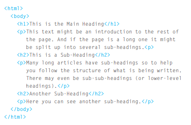
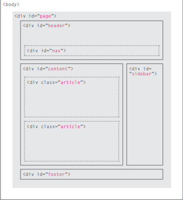

# How People Access the Web

* **Browsers** 

People access websites using
software called a web browser.
Popular examples include
Chrome, Firefox, Internet Explorer, Safari, and Opera.

In order to view a web page,
users might type a web address
into their browser, follow a
link from another site, or use a
bookmark.

* **Web Servers**

When you ask your browser for
a web page, the request is sent
across the Internet to a special
computer known as a web
server which hosts the website.

Web servers are special
computers that are constantly
connected to the Internet, and
are optimized to send web pages
out to people who request them.

* **Screen readers**

Screen readers are programs
that read out the contents of a
computer screen to a user. They
are commonly used by people
with visual impairments.

In the same way that many
countries have legislation's
that require public buildings
to be accessible to those with
disabilities, many laws have
also been passed that require
websites be accessible to those
with disabilities.

# How the Web Works

When you visit a website, the web server
hosting that site could be anywhere in the
world. In order for you to find the location of
the web server, your browser will first connect
to a Domain Name System (DNS) server.

# HTML Describes the Structure of Pages
In the browser window you can see a web page that features exactly
the same content as the server send it . To
describe the structure of a web page, we add codes to the words we want
to appear on the page.

You can see example for the HTML code for a page below

# Body, Head & Title

1. **Body** :
You met the  < body > element
in the first example we created.
Everything inside this element is
shown inside the main browser
window.
2. **Head** : Before the < body > element you
will often see a < head > element.
This contains information
about the page (rather than
information that is shown within
the main part of the browser
window that is highlighted in
blue on the opposite page).
You will usually find a < title >
element inside the < head >
element.
3. **Title** : The contents of the < title >
element are either shown in the
top of the browser, above where
you usually type in the URL of
the page you want to visit, or
on the tab for that page (if your
browser uses tabs to allow you
to view multiple pages at the
same time).

# HTML5
In HTML5, web page authors do
not need to close all tags, and
new elements and attributes will
be introduced. At the time of
writing, the HTML5 specification
had not been completed, but
the major browser makers had
started to implement many of
the new features, and web page
authors were rapidly adopting
the new markup.

Despite the fact that HTML5
is not yet completed, you can
safely take advantage of the
new features of the language as
long as you endeavour to ensure
that users with older browsers
will be able to view your pages.

# DOCTYPES
Because there have been
several versions of HTML, each
web page should begin with a
DOCTYPE declaration to tell a
browser which version of HTML
the page is using (although
browsers usually display the
page even if it is not included).

# Comments in HTML
If you want to add a comment
to your code that will not be
visible in the user's browser, you
can add the text between these
characters:

< !-- comment goes here -->

It is a good idea to add
comments to your code because,
no matter how familiar you
are with the page at the time
of writing it, when you come
back to it later (or if someone
else needs to look at the code),
comments will make it much
easier to understand.

Although comments are not
visible to users in the main
browser window, they can be
viewed by anyone who looks at
the source code behind the page.

# Grouping Text & Elements In a Block
* < div > : The < div > element allows you to
group a set of elements together
in one block-level box.

* < span > : The < span > element acts like
an inline equivalent of the < div >
element. It is used to either:

1. Contain a section of text
where there is no other suitable
element to differentiate it from
its surrounding text

2. Contain a number of inline
elements

* < iframe > : An iframe is like a little window
that has been cut into your
page — and in that window you
can see another page. The term
iframe is an abbreviation of inline
frame.

# Traditional HTML Layouts
For a long time, web page authors used < div > elements to group
together related elements on the page (such as the elements that form a
header, an article, footer or sidebar). Authors used class or id attributes
to indicate the role of the < div > element in the structure of the page.

# HTML5 layout:

**HTML5** is introducing a new set of elements that help define the structure of a page.

HTML5 Layout Elements While the traditional HTML uses ‘div’ element to group related elements on the page (such as the elements that form a header, an article, footer, or sidebar). HTML5 introduces a new set of elements that allow you to divide up the parts of a page. The names of these elements indicate the kind of content you will find in them.

===

## Who is the Site For?
Every website should be designed for the
target audience—not just for yourself or the
site owner. It is therefore very important to
understand who your target audience is.

## Why People Visit YOUR Website
Now that you know who your visitors are, you
need to consider why they are coming. While
some people will simply chance across your
website, most will visit for a specific reason.

## What Your Visitors are Trying to Achieve
It is unlikely that you will be able to list every
reason why someone visits your site but you
are looking for key tasks and motivations. This
information can help guide your site designs.

## What Information Your Visitors Need
You know who is coming to your site and why
they are coming, so now you need to work out
what information they need in order to achieve
their goals quickly and effectively.

## How Often People Will Visit Your Site
Some sites benefit from being updated more
frequently than others. Some information (such
as news) may be constantly changing, while
other content remains relatively static

# WRITING A SCRIPT 
To write a script, you need to first
state your **goal** and then **list the
tasks** that need to be completed in
order to achieve it. 

Start with the big picture of what
you want to achieve, and break
that down into smaller steps. 

1. **DEFINE THE GOAL**

First, you need to define the task you want to
achieve. You can think of this as a puzzle for the
computer to solve.

2. **DESIGN THE SCRIPT**

To design a script you split the goal out into a series
of tasks that are going to be involved in solving this
puzzle. This can be represented using a flowchart.
You can then write down individual steps that the
computer needs to perform in order to complete
each individual task (and any information it needs to
perform the task), rather like writing a recipe that it
can follow.

3. **CODE EACH STEP**

Each of the steps needs to be written in a
programming language that the compu ter
understands. In our case, this is JavaScript. 
