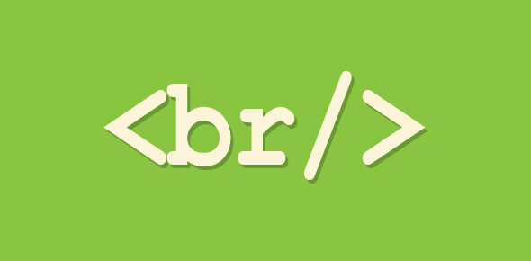

# Text Formatting In HTML

## What is text formatting in HTML?

HTML Formatting is a process of formatting text for better look and feel. HTML provides us ability to format text without using CSS. There are many formatting tags in HTML. These tags are used to make text bold, italicized, or underlined.

# Headings

## What are headings in HTML ?

A HTML heading or HTML h tag can be defined as a title or a subtitle which you want to display on the webpage.   
There are six different HTML headings which are defined with the h1 to h6 tags, from highest level h1 (main heading) to the least level h6 (least important heading).

# Paragraph

## What is a paragraph in HTML?

The HTML "tag p tag" element represents a paragraph. Paragraphs are usually represented in visual media as blocks of text separated from adjacent blocks by blank lines and/or first-line indentation, but HTML paragraphs can be any structural grouping of related content, such as images or form fields.

# Bold & Italic

## How do you bold and italicize in HTML?

Open up the phrase you want bold and italicized with the "tag b tag". Open up the phrase that you want bold and italicized with the "tag i tag". Type the text you want boldfaced and italicized. Type the closing tag for the italicizing, "tag /i tag". 

# Superscript and Subscript

## What is difference between subscript and superscript? 
A subscript or superscript is a character (such as a number or letter) that is set slightly below or above the normal line of type, respectively. It is usually smaller than the rest of the text. Subscripts appear at or below the baseline, while superscripts are above.

## How do you do subscript and superscript in HTML?
The "tag sub tag" defines the subscript text. Subscript text appears half a character below the normal line and is sometimes rendered in a smaller font. Subscript text can be used for chemical formulas, like H2O to be written as H2O. Superscript: The "tag sup tag" is used to add a superscript text to the HTML document.

# Line Breaks & Horizontal Rules

## What is a line break in HTML?

The HTML "tag br tag" element produces a line break in text (carriage-return). It is useful for writing a poem or an address, where the division of lines is significant.

## How do you do a line break in HTML?
To add a line break to your HTML code, you use the "tag br tag". The "tag br tag" does not have an end tag. You can also add additional lines between paragraphs by using the "tag br tag". Each "tag br tag" you enter creates another blank line.

## HTML elements are used to describe the structure of the page (e.g. headings, subheadings, paragraphs).

============

# Introducing CSS
## What CSS Does?
CSS is the language for describing the presentation of Web pages, including colors, layout, and fonts. It allows one to adapt the presentation to different types of devices, such as large screens, small screens, or printers. CSS is independent of HTML and can be used with any XML-based markup language.

## Which benefits will CSS give you?
### Some of the advantages of using CSS are:
* Easier to maintain and update.
* Greater consistency in design.
* More formatting options.
* Lightweight code.
* Faster download times.
* Search engine optimization benefits.
* Ease of presenting different styles to different viewers.
* Greater accessibility.

## What are the 3 types of CSS?
Difference Between the 3 Types of CSS Styles: Inline, External and Internal. In this tutorial, you will learn the difference between the three types of CSS styles: inline, external, and internal.

 
## What is difference between HTML and CSS?

Quite simply, HTML (Hypertext Markup Language) is used to create the actual content of the page, such as written text, and CSS (Cascade Styling Sheets) is responsible for the design or style of the website, including the layout, visual effects and background color.

# How CSS Rules Cascade

## What does Cascade mean in CSS?
Cascading means that styles can fall (or cascade) from one style sheet to another, enabling multiple style sheets to be used on one HTML document. Even the simplest HTML document may have three or more style sheets associated with it including: The browser's style sheet.

## Rules are made up of selectors (that specify the elements the rule applies to) and declarations (that indicate what these elements should look like).
## And CSS rules usually appear in a separate document, although they may appear within an HTML page.

## What is style rule cascading?
A Cascading Stylesheet rule tells the browser what the HTML looks like, and what it should do. For example, a rule can be set up that tells the browser to format every "tag P tag" so that its first line is indented.

# Different versions of CSS & Browser Quirks
CSS1 was released in 1996 and CSS2 followed two years later. Work on CSS3 has been ongoing but the major browsers have already started to implement it.
Any seasoned user of CSS will tell you that some browsers display a few of the CSS properties in an unexpected way. But finding and squashing
those bugs is easy when you know how.

# Basic JavaScript Instructions
## Is JavaScript easy to learn for beginners?
JavaScript isn't exactly hard to learn, but if it's your first programming language adjusting to the mindset required for programming can take a lot of time. JavaScript is actually one of the easier programming languages to start with. In fact, there are several resources available to help you learn it with ease.

## How read and write in JavaScript?
1. file = fopen(getScriptPath(),0); The function fread() is used for reading the file content.
2. str = fread(file,flength(file) ; The function fwrite() is used to write the contents to the file.
3. file = fopen("c:\MyFile.txt", 3);// opens the file for writing.

# Statements
A script is a series of instructions that a computer can follow one-by-one. Each individual instruction or step. and the statements should end with a semicolon.

# Comments
Comments in JavaScript are used to explain the code and make the program more readable for developers. There are single-line comments (which comment out one line or a part of one line) and multi-line comments (which comment out a block of code). Multi-line comments are more often used for formal documentations.

# Variables

A variable is a quantity that may change within the context of a mathematical problem or experiment. Typically, we use a single letter to represent a variable. The letters x, y, and z are common generic symbols used for variables.

## What are variables used for in JavaScript?
In JavaScript, variables are used to hold a value. It can hold any value, from primitives to objects.

## What are the types of variables?

There are six common variable types:
1. Dependent variables.
2. Independent variables.
3. Intervening variables.
4. Moderator variables.
5. Control variables.
6. Extraneous variables.

# Data type

## JavaScript allows you to work with three primitive data types: 
* numbers
* strings of text (known as “strings”) 
* boolean truth values (known as “booleans”). JavaScript also defines two trivial data types, null and undefined, each of which defines only a single value.

# Arrays
Is a single variable that is used to store different elements.Unlike most languages where array is a reference to the multiple variable, in JavaScript array is a single variable that stores multiple elements. Declaration of an Array. There are basically two ways to declare an array.

# Expressions
Any unit of code that can be evaluated to a value is an expression . Since expressions produce values, they can appear anywhere in a program where JavaScript expects a value such as the arguments of a function invocation. As per the MDN documentation, JavaScript has the following expression categories.

## What are the three types of expressions in the JavaScript language?
1. Arithmetic: evaluates to a number, for example 3.14159.
2. String: evaluates to a character string, for example, "Fred" or "234".
3. Logical: evaluates to true or false.

# Operators
An operator is a symbol that tells the compiler to perform a certain mathematical or logical manipulation. Operators are used in programs to manipulate data and variables.

## How many operators are there in JavaScript?
JavaScript comes with a set of operators you'd expect from any modern language. There are four categories:   
 1. arithmetic.
 2. comparison.
 3. Assignment.
 4. logical.

# Decisions and Loops

)

## Decision Making Statements
Decision Making in programming is similar to decision making in real life.
A programming language uses control statements to control the flow of execution of the program based on certain conditions.
## JavaScript’s conditional statements are:
1) if
2) if-else
3) if…else…if
4) switch

## Looping Statements
Looping in programming languages facilitates the execution of a set of instructions/functions repeatedly while some condition evaluates to true.
For example, suppose we want to print “Hello World” 10 times this is possible with the help of loops.
There are mainly two types of loops:
1. Entry Controlled loops: In this type of loops the test condition is tested before entering the loop body.
For Loop and While Loop are entry controlled loops.
2. Exit Controlled Loops: In this type of loops the test condition is tested or evaluated at the end of loop body. Therefore, the loop body will execute atleast once, irrespective of whether the test condition is true or false. do-while loop is exit controlled loop.
## Following are the types of loops in JavaScript:
1. while loop
2. do-while loop
3. for loop
4. for…in loop