# HTML Lists, Control Flow with JS, and the CSS Box Model

# Lists

## There are lots of occasions when we
need to use lists. HTML provides us with
three different types:
1. Ordered lists are:
a collection of items where each item holds a relative position that is based upon some underlying characteristic of the item

2. Unordered lists are:
 displayed with a bullet, which can be of several forms, like a dot, a circle, or a square

3. Definition lists are:
a list of terms and corresponding definitions. Definition lists are typically formatted with the term on the left with the definition following on the right or on the next line.

## Ordered Lists
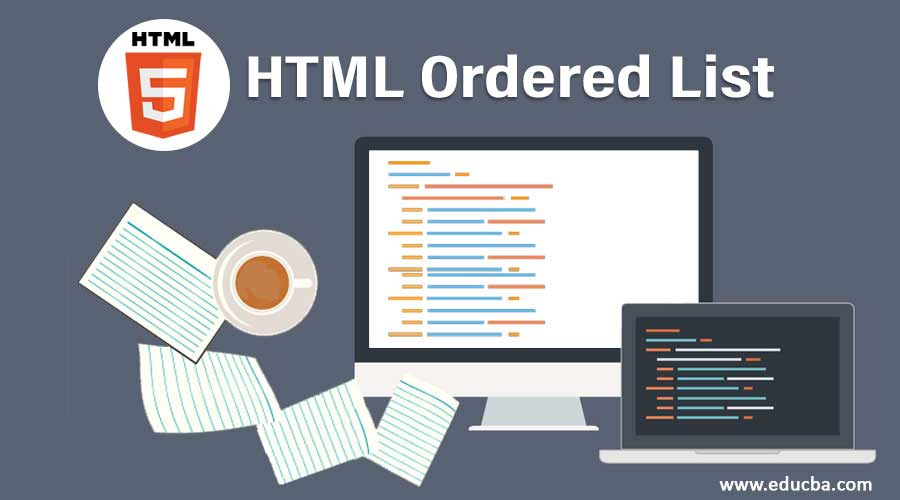

To create ordered list in HTML, use the `<ol>` . Ordered list starts with the `<ol>` . The list item starts with the `<li>` and will be marked as numbers, lowercase letters uppercase letters, roman letters, etc. The default numbers for list items.

## Unordered Lists
The `<ul>` defines an unordered (bulleted) list. Use the `<ul>` together with the `<ul>` to create unordered lists. Tip: Use CSS to style lists. Tip: For ordered lists, use the `<ol>`.

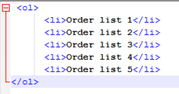

## Definition lists
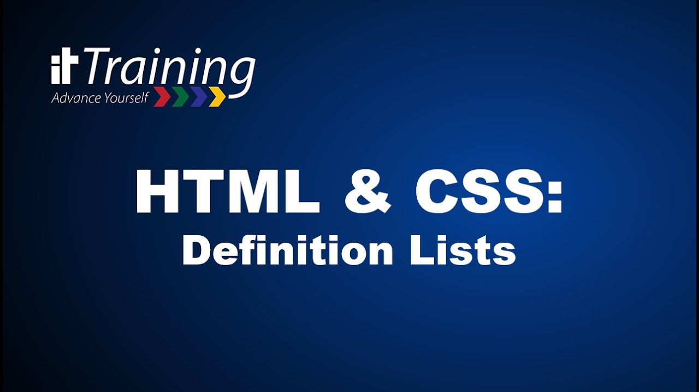

Use the `<dl>` to add definition lists. The HTML `<dl>` is used for declaring a definition list. This tag is used within  `<dd>` . A definition list is similar to other lists but in a definition list, each list item contains two entries; a term and a description.


## Boxes

There are several properties that affect the appearance of boxes:
- Control the dimensions of your boxes
- Create borders around boxes
- Set margins and padding for boxes
- Show and hide boxes


### Box Dimensios  `width`  `height`

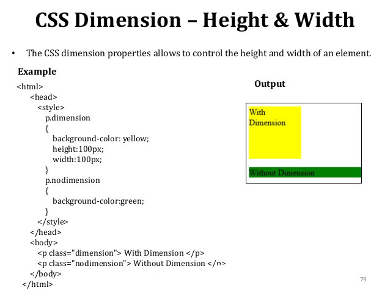


### Limiting Width  `min-width`  `max-width`

To page designs expand and shrink to fit the size of the user's screen. 

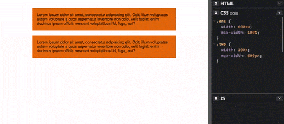


### Limiting Height  `min-height`  `max-height`


### Overflowing Content `overflow`

The overflow property tells the browser what to do if the content contained within a box is larger than the box itself. 
It can have one of two values:
1. `hidden`
2. `scroll`

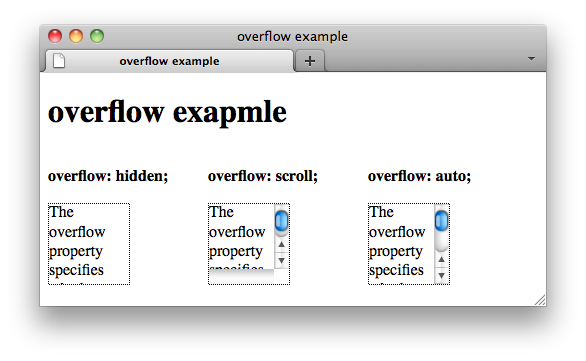


### Border, Margin & Padding  `border`  `padding`  `margin`


### Borders properties  `border-width` `border-style` `border-color` 

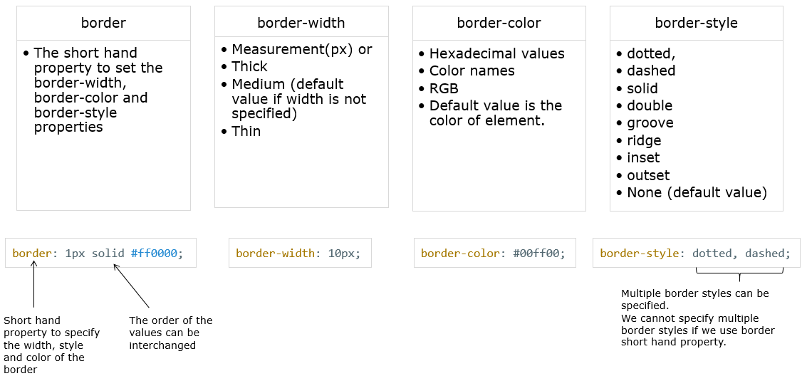


### Display `display`

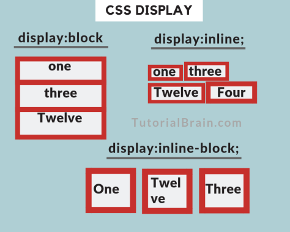


### Visibility  `visibility`

This property can take two values:
1. `hidden`
2. `visible`

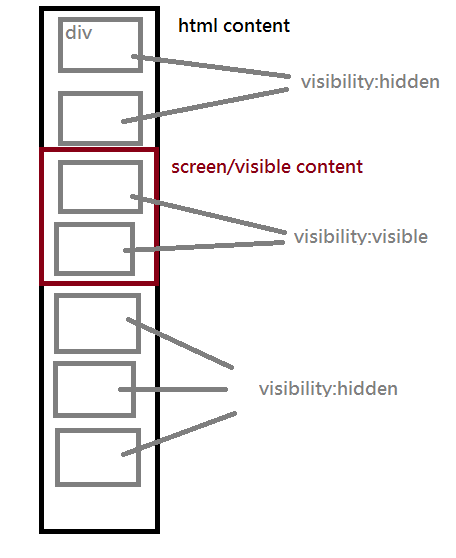


### Border Image  `border-image`

The border-image property applies an image to the border of any box. 
It takes a background image and slices it into nine pieces. 

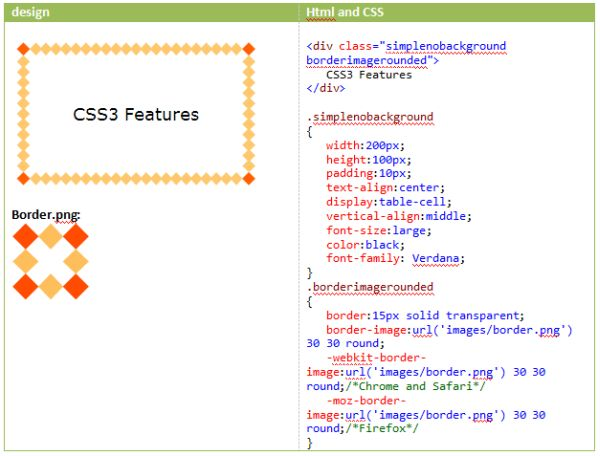


### Box Shadows  `box-shadow`

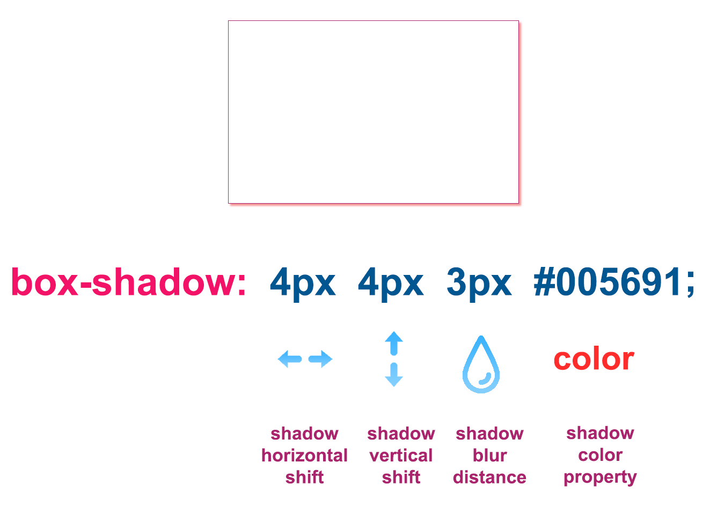


### Rounded Corners and Elliptical Shapes  `border-radius`

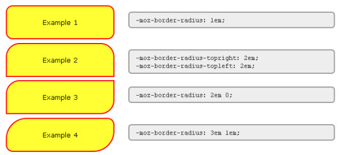


# Basic JavaScript Instructions


## Switch

```
switch (level) {
case 1:
msg = 'Good luck on the first test ' ;
break;
case 2:
msg = 'Second of three - keep going!';
break;
case 3:
msg = ' Final round, al most there!';
break;
default :
msg = 'Good l uck!';
break;
}
```
# Arrays

## What are arrays in JS?
Array: is an ordered list of values. Each value is called an element specified by an index. ... First, an array can hold values of different types. For example, you can have an array that stores the number and string, and boolean values. Second, the length of an array is dynamically sized and auto-growing.

```
var colors;
colors ['white', 'black', ' custom']; 
```

## How do you call an array in JavaScript?
An array can hold many values under a single name, and you can access the values by referring to an index number.
1. Creating an Array. 
2. Using the JavaScript Keyword new. 
3. Access the Elements of an Array. 
4. Changing an Array Element. 
5. Access the Full Array. 
6. Arrays are Objects. 
7. Array Properties and Methods. 
8. The length Property.

## How do you clear an array?

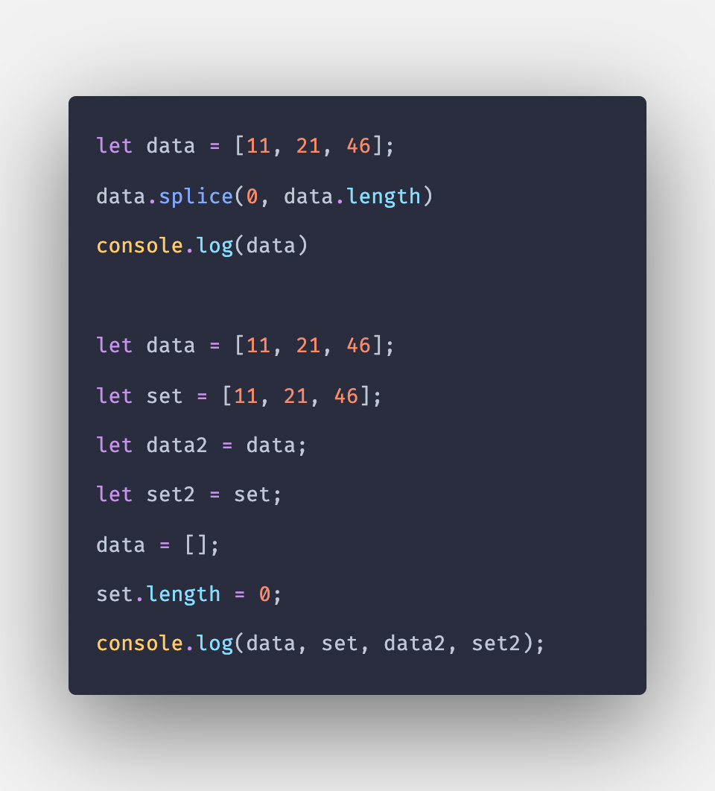