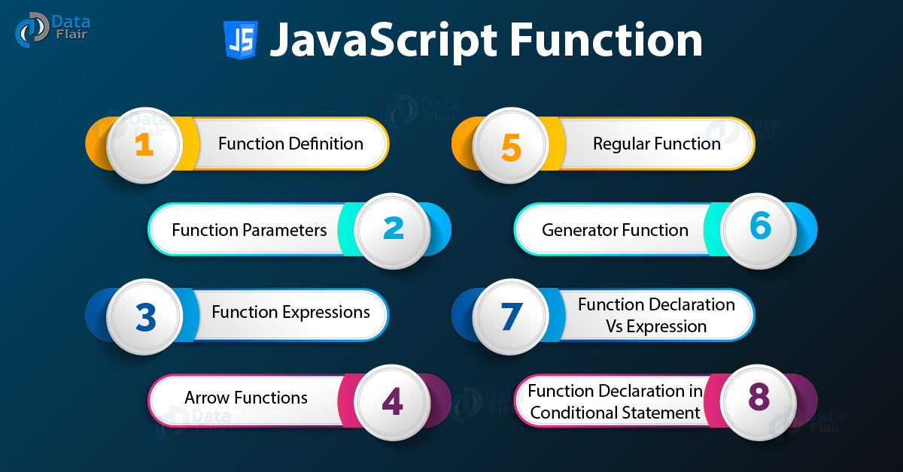

# HTML Links, CSS Layout, JS Functions

# Links

## what does link in html mean?
 A link (short for hyperlink) is an HTML object that allows you to jump to a new location when you click or tap it.
 Links are created using the `< a >`  element. Users can click on anything between the opening `<a>` and the closing `</a>`. You specify which page you want to link to using the href attribute.
The `<a>` element uses the `href` attribute to ***indicate the page we are linking to***.

If we are linking to a page within our own site, it is best to use ***relative links*** rather than qualified ***URLs***.
We can create links to open email programs with an email address in the "to" field.
We can use the `id` attribute to target elements within a page that can be linked to.


### Keywords:

`Absolute URL` When you link to a different website, the value of the `href` attribute will be the full web address for the site.

`Relative URL` When you are linking to other pages within the same site.

`Directories` Folders on a website. 

`mailto: ` To create a link that starts up the user's email program and addresses an email to a specified email address.

`target` If I want a link to open in a new window.

====

# Layout


## What is layout in HTML?
HTML layouts provide a way to arrange web pages in well-mannered, well-structured, and in responsive form or we can say that HTML layout specifies a way in which the web pages can be arranged. Web-page layout works with arrangement of visual elements of an HTML document.
## What are the 4 basic layout types?
There are four basic types of layouts:  
1. process
2. product
3. hybrid
4. fixed position.

## Controlling the Position of Elements in HTML
To use positioning on an element, you must first declare its position property , which specifies the type of positioning method used for an element. Using the position property values, the elements are positioned using the top, bottom, left, and right properties.

## How do you change the position of text in HTML?
To set text alignment in HTML, use the style attribute. The style attribute specifies an inline style for an element. The attribute is used with the HTML `<p>` , with the CSS property text-align for the center, left and right alignment.

## How do I position a div in HTML?
Position: absolute divs are usually positioned by coding top, left or right and width. Height is not essential if a div is to allow expansion down if larger text is chosen but other divs must be positioned to allow for this.

## Fixed Positioning
Fixed positioning is a type of absolute positioning that requires the position property to have a value of fixed.

## Floating Elements
The float property allows you to take an element in normal flow and place it as far to the left or right of the containing element as possible.

The float property can have one of the following values: left - The element floats to the left of its container. right - The element floats to the right of its container. none - The element does not float (will be displayed just where it occurs in the text). inherit - The element inherits the float value of its parent.

## How do you float elements side by side?
Three or more different div can be put side-by-side using CSS. Use CSS property to set the height and width of div and use display property to place div in side-by-side format. float:left; This property is used for those elements(div) that will float on left side.
--------------------------------

## Position property in CSS


`z-index`: to control which element sits on top.

`float`: to take an element in normal flow and place it as far to the left or right of the containing element as possible.

`clear`: to say that no element (within the same containing element)
should touch the left or righthand sides of a box. 

`Resolution` refers to the number of dots a screen shows per inch.

`Fixed width` layout: designs do not change size as the user increases or decreases
the size of their browser window. Measurements tend to be given in pixels.

`Liquid` layout designs: stretch and contract as the user increases or decreases the
size of their browser window. They tend to use percentages.

`Grid`:  the placement or arrangement of visual elements.

===========
# Functions
## What are functions in JavaScript?

A function in JavaScript is similar to a procedure.
a set of statements that performs a task or calculates a value, but for a procedure to qualify as a function, it should take some input and return an output where there is some obvious relationship between the input and the output.

## How many types of functions are there in JavaScript?

## How do functions work in JavaScript?
Functions are executed when they are called.   
Values can be passed into functions and used within the function. Functions always return a value. In JavaScript, if no return value is specified, the function will return undefined.

## Declaring a Function


## Calling a Function


## How do you return a value from a JavaScript function?
JavaScript provides for passing one value back to the code that called it after everything in the function that needs to run has finished running. JavaScript passes a value from a function back to the code that called it by using the return statement . The value to be returned is specified in the return keyword.

## Can a function return multiple values?
A function is not restricted to return a variable, it can return zero, one, two or more values. This is the default property of python to return multiple values/variables which is not available in many other programming languages like C++ or Java.


## Immediately invoked functions

```
var area = (function(){
var width = 3;
var height = 2;
return width * height;
} () );
```

================

# Reasons for Pair Programming

## How does pair programming work?
 
 Pair programming essentially means that two people write code together on one machine. It is a very collaborative way of working and involves a lot of communication. While a pair of developers work on a task together, they do not only write code, they also plan and discuss their work.

Pair programming leads to:
1. Greater efficiency
2. Engaged collaboration
3. Learning from fellow students
4. Social skills
5. Job interview readiness
6. Work environment readiness


