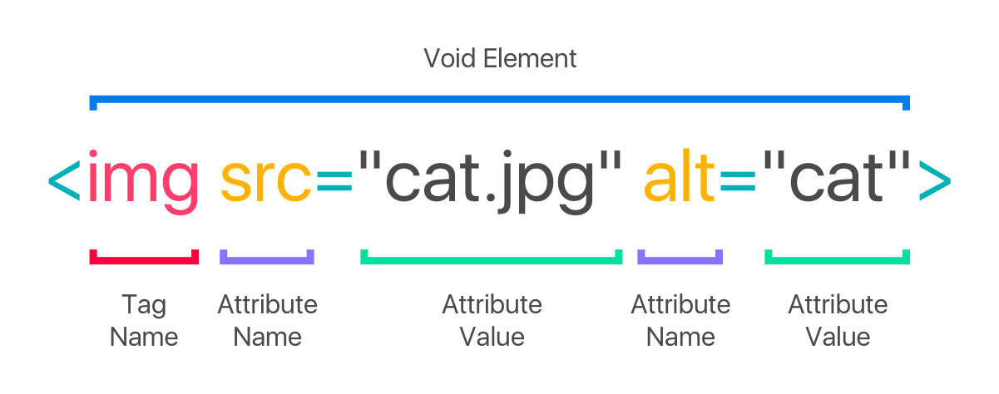
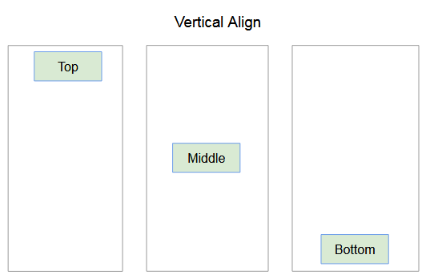
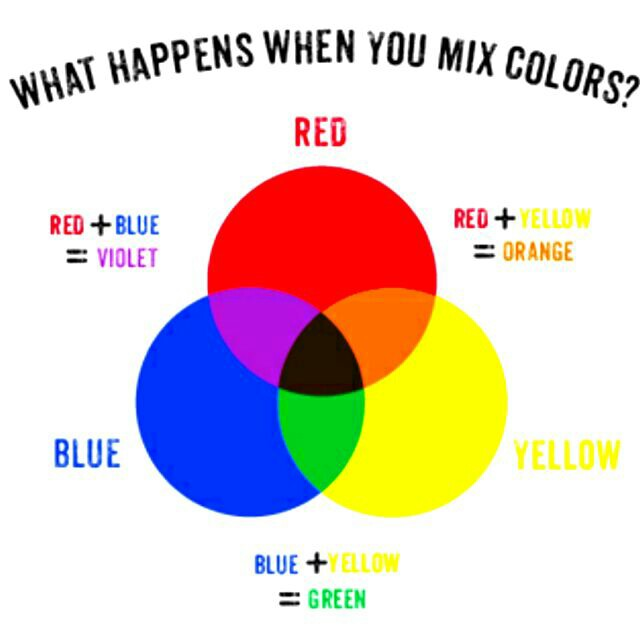
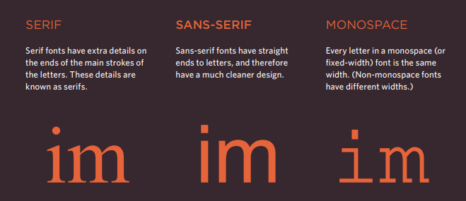
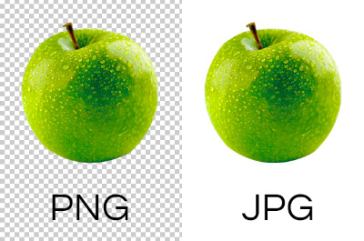

# HTML Images

There are many reasons why you might
want to add an image to a web page: you
might want to include a logo, photograph,
illustration, diagram, or chart.

## How do you create an image in HTML?

1. Use the HTML  `` tag element to define an image.
2. Use the HTML `src` attribute to define the URL of the image.
3. Use the HTML `alt` attribute to define an alternate text for an image, if it cannot be displayed.

# Height & Width of Images

## Height

This specifies the height of the
image in pixels.

## Width

This specifies the width of the
image in pixels.

# Where to Place Images in Your Code?

1. Before a paragraph.
2. Inside the start of a paragraph.
3. In the middle of a paragraph.

# Aligning Images Horizontally

align horizontally.html HTML
The align attribute was
commonly used to indicate how
the other parts of a page should
flow around an image.
The align attribute can take
these horizontal values:

1. Left
This aligns the image to the left
(allowing text to flow around its
right-hand side).
2. Right
This aligns the image to the right
(allowing text to flow around its
left-hand side).

# Aligning Images Vertically

There are three values that the
align attribute can take that
control how the image should
align vertically with the text that
surrounds it:

1. **Top**
This aligns the first line of the
surrounding text with the top of
the image.

2. **Middle**
This aligns the first line of the
surrounding text with the middle
of the image.

3. **Bottom**
This aligns the first line of the
surrounding text with the bottom
of the image.

# Three Rules for Creating Images

* Save images in the right format.
* Save images at the right size.
* Use the correct resolution.

**You should save images at the size you will be using them on the web page and in the appropriate format**

## Image Dimensions

The images you use on your website should be
saved at the same width and height that you
want them to appear on the page.

## Cropping Images

When cropping images it is important not to
lose valuable information. It is best to source
images that are the correct shape if possible.

## Figure and Figure Caption

* **Figure** tag  

Images often come with
captions. HTML5 has introduced
a new (figure) tag element to
contain images and their caption
so that the two are associated.
You can have more than one
image inside the (figure) tag
element as long as they all share
the same caption.

* **Figure caption** tag

The `<figcaption>` tag element has
been added to HTML5 in order
to allow web page authors to add
a caption to an image.
Before these elements were
created there was no way to
associate an `` tag element with
its caption.

 
 
===========

# Color

## Foreground Color

The color property allows you
to specify the color of text inside
an element. You can specify any
color in CSS in one of three ways:

1. **rgb values**  
These express colors in terms
of how much red, green and
blue are used to make it up. For
example: rgb(100,100,90)
2. **hex codes**
These are six-digit codes that
represent the amount of red,
green and blue in a color,
preceded by a pound or hash #
sign. For example: #ee3e80
3. **color names**
There are 147 predefined color
names that are recognized
by browsers. For example:
**DarkCyan**

## Background Color

CSS treats each HTML element
as if it appears in a box, and the
background-color property
sets the color of the background
for that box.
You can specify your choice of
background color in the same
three ways you can specify
foreground colors: RGB values,
hex codes, and color names.
If you do not specify a
background color, then the
background is transparent.

## Understanding Color

Every color on a computer screen is created by mixing amounts of red,
green, and blue. To find the color you want, you can use a color picker.

## RGB Values

Values for red, green, and blue
are expressed as numbers
between 0 and 255.

## Hex Codes

Hex values represent values
for red, green, and blue in
hexadecimal code.

## Color Names

Colors are represented by
predefined names. However,
they are very limited in number.

## Hue

Hue is near to the colloquial idea
of color. Technically speaking
however, a color can also have
saturation and brightness as
well as hue.

## Saturation

Saturation refers to the amount
of gray in a color. At maximum
saturation, there would be no
gray in the color. At minimum
saturation, the color would be
mostly gray.

## Brightness

Brightness refers to how much black is in a color.
At maximum brightness, there
would be no black in the color.
At minimum brightness, the
color would be very dark.

## Notes

1. CSS3 has introduced an extra value for RGB colors to 
indicate opacity. It is known as RGBA.
2. CSS3 also allows you to specify colors as HSL values,
with an optional opacity value. It is known as HSLA.
-----------
# Text

## The properties that allow you to control the appearance of text can be split into two groups

* Those that directly affect the font and its appearance
(including the typeface, whether it is regular, bold or italic, and the size of the text).
* Those that would have the same effect on text no matter what font you were using (including the color of text and the spacing between words and letters).

## Typeface Terminology

* **Serif**

    Serif fonts have extra details on 
the ends of the main strokes of
the letters. These details are known as serif.
* **Sans-Serif**
    
    Sans-serif fonts have straight
ends to letters, and therefore
have a much cleaner design.
* **Monospace**
    
    Every letter in a monospace (or
fixed-width) font is the same
width. (Non-monospace fonts
have different widths.).

## The xyz

1. Weight

    * Light
    * Medium
    * Bold
    * Black

2. Style

    * Normal
    * Italic
    * Oblique

3. Stretch

    * Condensed
    * Regular
    * Extended

## Specifying Typefaces font-family

The font-family property
allows you to specify the
typeface that should be used for
any text inside the element(s) to
which a CSS rule applies.
The value of this property is the
name of the typeface you want
to use.
The people who are visiting
your site need the typeface you
have specified installed on their
computer in order for it to be
displayed.

## Size of Type font-size

The font-size property enables you to specify a size for the font. There are several ways to specify the size of a font. The most common are:

1. **pixels**
    
    Pixels are commonly used because they allow web
designers very precise control over how much space their text takes up. The number of pixels is followed by the letters px.
2. **percentages**
    
    The default size of text in browsers is 16px. So a size of 75% would be the equivalent of 12px, and 200% would be 32px.

## Units of Type Size

1. **Pixels**
    
    Pixels are relative to the
resolution of the screen, so the
same type size will look larger
when a screen has a resolution
of 800x600 than it would when
it is 1280x800.
2. **Percentages**
    
    The default size of text in a
web browser is 16 pixels. Using
percentages of this amount, you
can create a scale where the
default text size is 12 pixels, and
headings are sized in relation
to this.
3. **Ems**
    
    Ems allow you to change the size
of text relative to the size of the
text in the parent element. Since
the default size of text in web
browsers is 16 pixels, you can
use similar rules to those shown
for percentages.

# UpperCase and LowerCase

The text-transform property
is used to change the case of
text giving it one of the following
values:

* **uppercase**
This causes the text to appear uppercase.
* **lowercase**
This causes the text to appear lowercase.
* **capitalize**
This causes the first letter of each word to appear capitalized.

# Underline and Strike

The text-decoration property allows you to specify the following values:

1. **None**
This removes any decoration already applied to the text.
2. **Underline**  
This adds a line underneath the text.
3. **Overline**  
This adds a line over the top of the text.
4. **Line-through**  
This adds a line through words.
5. **Blink**  
This animates the text to make it
flash on and off (however this is
generally frowned upon, as it is
considered rather annoying).

# Alignment

## text-align

The text-align property allows you to control the alignment of text. The property can take one of four values:

1. **Left**  
This indicates that the text
should be left-aligned.
2. **Right**
This indicates that the text
should be right-aligned.
3. **Center**
This allows you to center text.
4. **justify**
This indicates that every line in
a paragraph, except the last line,
should be set to take up the full
width of the containing box.

# Styling Links

## :link, :visited

In CSS, there are two pseudo classes that allow you to set different styles for links that have and have not yet been visited.

1. **:link**
This allows you to set styles for links that have not yet been visited.

2. **:visited**
This allows you to set styles for links that have been clicked on. They are commonly used to control colors of the links and also whether they are to appear underlined or not.

# Notes

1. There are properties to control the choice of font, size, weight, style, and spacing.
2. There is a limited choice of fonts that you can assume
most people will have installed.
3. You can control the space between lines of text,
individual letters, and words. Text can also be aligned
to the left, right, center, or justified. It can also be indented.

# JPEG vs PNG vs GIF

Use JPEG format for all images that contain a natural scene or photograph where variation in colour and intensity is smooth. Use PNG format for any image that needs transparency or for images with text & objects with sharp contrast edges like logos. Use GIF format for images that contain animations.

## Is GIF or JPEG better quality?

While GIF is great for computer generated images with limited palettes, JPG is far better for photographs. It gives better quality images for the same file size
The image on the right is the same region compressed using GIF. The GIF file is 2.4 times bigger than the JPG, but is clearly of lower quality.

## When should I use PNG or JPEG?

PNG format is a lossless compression file format, which makes it a common choice for use on the Web. PNG is a good choice for storing line drawings, text, and iconic graphics at a small file size. JPG format is a lossy compressed file format. This makes it useful for storing photographs at a smaller size than a BMP.

## Is JPEG or PNG better for Web?

The PNG file type holds more data than a JPG. Unlike JPGs, PNG compression is lossless. Simply put, you can reduce the size of the image while maintaining the quality. If you are a photography website, for example, even the smallest downgrade in quality can make a difference for your audience.
