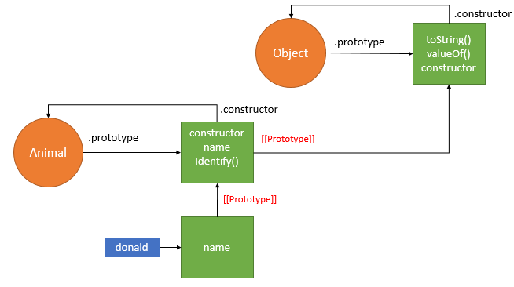

# Understanding the problem domain is the hardest part of programming

## What is the hardest thing about writing code?
* Learning a new technology.
* Naming things.
* Testing your code.
* Debugging.
* Fixing bugs.
* Making software maintainable.
## How to build the same simple application over and over again in each of courses?

The answer is :  “familiarity”.

## What is a problem domain?

A problem domain is the area of expertise or application that needs to be examined to solve a problem. A problem domain is simply looking at only the topics you are interested in, and excluding everything else. It is the area where the problems your application is intended to solve, belong to.

## Why problem domains are hard?

When writing code is a lot like putting together a jigsaw puzzle (this pictuer):  
 

 so we put together code with the purpose of building components that we have taken out of the “bigger picture” of the problem domain.   
The big issue is that many problem domains are like a puzzle with a blurry picture or no picture at all.

## Programming is easy if you understand the problem domain

If understanding the problem domain is the hardest part of programming and you want to make programming easier, you can do one of two things:

1. Make the problem domain easier.
2. Get better at understanding the problem domain.

# Object Literals

## What is an Object?
Objects group together a set of variables and functions to create a model of a something you would recognize from the real world.   

If a variable is part of an object, it is called a
property. Properties te ll us about the object, such as
the name of a hotel or the number of rooms it has.
Each individual hotel might have a different name
and a different number of rooms.   

If a function is part of an object, it is called a method.
Methods represent tasks that are associated with
the object. For example, you can check how many
rooms are available by subtracting the number of
booked rooms from the total number of rooms.

## To create an Object :
To create an object, use the new keyword with Object() constructor, like this:  
 const person = new Object();  
Now, to add properties to this object, we have to do something like this : person.

## To accessing an Object And Dot notation 
JavaScript provides two notations for accessing object properties. The first, and most common, is known as dot notation. Under dot notation, a property is accessed by giving the host object's name, followed by a period (or dot), followed by the property name.
## Create more an Object

It is very easy to create a single object than to create multiple objects of the same type. To breach this hurdle, javascript has provided object constructor function. Using this function, initially, we have to create the type of the object and later on, we need to declare the properties of the object.

# Document Object Model (**DOM**)

The Document Object Model (DOM) specifies
how browsers should create a model of an HTML
page and how JavaScript can access and update the
contents of a web page while it is in the browser window.   
The DOM is neither part of HTML, nor part of JavaScript; it is a separate set of rules.
It is implemented by all major browser makers, and covers two primary areas:  
1. Making a model of the HTML page .
2. Accessing and CHANGING the HTML page .

## The DOM tree is a model of a web page

As a browser loads a web page, it creates a model of that page.
The model is called a DOM tree, and it is stored in the browsers' memory.
It consists of four main types of nodes.

The nodes are:
1. THE DOCUMENT NODE
2. ELEMENT NODES
3. ATTRIBUTE NODES
4. TEXT NODES

## WORKING WITH THE DOM TREE 
Accessing and updating the DOM tree involves two steps: 
1. Locate the node that represents the element you want to work with.
2. Use its text content, child elements, and attributes. 

### STEP 1: ACCESS THE ELEMENTS 

### STEP 2: WORK W ITH THOSE ELEMENTS 

## ACCESSING ELEMENTS 

METHODS THAT RETURN A SINGLE ELEMENT NODE: 

METHODS THAT RETURN ONE OR MORE ELEMENTS (AS A NODELIST): 

## TRAVERSING THE DOM
When you have an element node, you can select
another element in relation to it using these five
properties. This is known as traversing the DOM. 

* parentNode

This property finds the element
node for the containing (or
parent) element in the HTML. 

* previousSibling & nextSibling

These properties find the
previous or next sibling of a node
if there are siblings. 

* firstChild & lastChild 

These properties find the first or
last child of the current element.

## WHITESPACE NODES 
Traversing the DOM can be difficult because
some browsers add a text node whenever they
come across whitespace between elements. 

