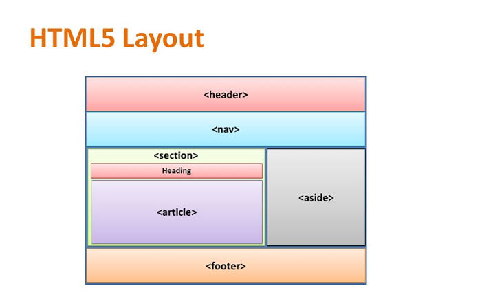

# CSS Layout

## What is layout in HTML?
HTML layouts provide a way to arrange web pages in well-mannered, well-structured, and in responsive form or we can say that HTML layout specifies a way in which the web pages can be arranged. Web-page layout works with arrangement of visual elements of an HTML document.
## What are the 4 basic layout types?
There are four basic types of layouts:  
1. **process**
2. **product**
3. **hybrid**
4. **fixed position.**

## Controlling the Position of Elements in HTML
To use positioning on an element, you must first declare its position property , which specifies the type of positioning method used for an element. Using the position property values, the elements are positioned using the top, bottom, left, and right properties.

## How do you change the position of text in HTML?
To set text alignment in HTML, use the style attribute. The style attribute specifies an inline style for an element. The attribute is used with the HTML `< p >` , with the CSS property text-align for the center, left and right alignment.

## How do I position a div in HTML?
**Position**: absolute divs are usually positioned by coding top, left or right and width. Height is not essential if a div is to allow expansion down if larger text is chosen but other divs must be positioned to allow for this.

## Fixed Positioning
**Fixed positioning** is a type of absolute positioning that requires the position property to have a value of fixed.

## Floating Elements
The **float** property allows you to take an element in normal flow and place it as far to the left or right of the containing element as possible.

The float property can have one of the following values: left - The element floats to the left of its container. right - The element floats to the right of its container. none - The element does not float (will be displayed just where it occurs in the text). inherit - The element inherits the float value of its parent.

## How do you float elements side by side?
Three or more different div can be put side-by-side using CSS. Use CSS property to set the height and width of div and use display property to place div in side-by-side format. float:left; This property is used for those elements(div) that will float on left side.

# Fixed Width Layouts in HTML

## What is fixed width layout?
A "fixed-width" layout is one in which the layout of the page is contained within a wrapper that doesn't adjust its size when the width of the browser changes. In this how to, you'll learn how to create a 2-column fixed-width layout.

## Advantages
1. Pixel values are accurate at controlling size and positioning of elements.
2. The designer has far greater control over the appearance and position of items on the page than with liquid layouts.
3. You can control the lengths of lines of text regardless of the size of the user's window.
4. The size of an image will always remain the same relative to the rest of the page.

## Disadvantages
1. You can end up with big gaps around the edge of a page.
2. If the user's screen is a much higher resolution than the designer's screen, the page can look smaller and text can be harder to read.
3. If a user increases font sizes, text might not fit into the allotted spaces.
4. The design works best on devices that have a site or resolution similar to that of desktop or laptop computers.
5. The page will often take up more vertical space than a liquid layout with the same content.

# Layout Grids

## What is a grid layout web design?
A grid is the basic structure or skeleton of your user interface. On a website, a grid is the division of the layout with either (or sometimes both) vertical and horizontal guidelines. The role of a grid in web design is to guide the designers with how and where to place elements on the page.

## How do you use grid layout?
To get started you have to define a container element as a grid with display: grid , set the column and row sizes with grid-template-columns and grid-template-rows , and then place its child elements into the grid with grid-column and grid-row . Similarly to flexbox, the source order of the grid items doesn't matter.

## Why grid layout is the best?
Efficiency — Grids allow designers to quickly add elements to a layout because many layout decisions are addressed while building the grid structure. Economy — Grids make it easier for other designers to work and collaborate on the design as they provide a plan for where to place elements.

## How do you make a grid in HTML?
To make an HTML element behave as a grid container, you have to set the display property to grid or inline-grid. Grid containers consist of grid items, placed inside columns and rows.