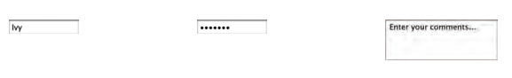

# Forms
## Why Forms?
The best known form on the web is probably
the search box that sits right in the middle of
Google's homepage

## Form Controls
There are several types of form controls that
you can use to collect information from visitors to your site.

### ADDING TEXT:

* Text input  : Used for a single line of text such as email addresses and names.

* Password input : Like a single line text box but it masks the characters entered.

* Text area : For longer areas of text, such as
messages and comments.

### Making Choices:

* Radio buttons : For use when a user must select one of a number of options.

* Checkboxes : When a user can select and
unselect one or more options.

* Drop-down boxes : When a user must pick one of a number of options from a list.

### Submitting Forms:

* Submit buttons : To submit data from your form
to another web page.

* Image buttons : Similar to submit buttons but
they allow you to use an image.

### Uploading Files:

* File upload : Allows users to upload files
(e.g. images) to a website.

## Form Structure

Form controls live inside a
< form > element. This element
should always carry the action
attribute and will usually have a
method and id attribute too.

## Text Input

The < input > element is used
to create several different form
controls. The value of the type
attribute determines what kind
of input they will be creating.

When the type attribute has a
value of text, it creates a single line text input.

When users enter information
into a form, the server needs to
know which form control each
piece of data was entered into. 

## Password Input
### type="password"
When the type attribute has
a value of password it creates
a text box that acts just like a
single-line text input, except
the characters are blocked out.
They are hidden in this way so
that if someone is looking over
the user's shoulder, they cannot
see sensitive data such as
passwords.

## Text Area
The < textarea > element
is used to create a multi-line
text input. Unlike other input
elements this is not an empty
element. It should therefore have
an opening and a closing tag. 

## Radio Button
Radio buttons allow users to pick
just one of a number of options.

## Checkbox
Checkboxes allow users to select
(and unselect) one or more
options in answer to a question

## Drop Down List Box
A drop down list box (also
known as a select box) allows
users to select one option from a
drop down list. The < select > element is used
to create a drop down list box. It
contains two or more < option >
elements. 

## Multiple Select Box

You can allow users to select
multiple options from this list by
adding the multiple attribute
with a value of multiple.

## File Input Box
This type of input creates a
box that looks like a text input
followed by a browse button.
When the user clicks on the
browse button, a window opens
up that allows them to select a
file from their computer to be
uploaded to the website.

## Search Input
If you want to create a single
line text box for search queries,
HTML5 provides a special
search input.
To create the HTML5 search box
the < input > element should
have a type attribute whose
value is search. Older browsers
will simply treat it like a single
line text box.

# Lists, Tables and Forms

## list-style-type

It can be used on rules that
apply to the < ol >, < ul >, and < li >
elements.

* Unordered Lists : none disc circle square
* Ordered Lists : decimal decimal-leading-zero
lower-alpha upper-alpha lower-roman upper-roman 

## list-style-image
You can specify an image to act
as a bullet point using the
list-style-image property.

## Table Properties
1. width to set the width of the
table
2. padding to set the space
between the border of each table
cell and its content
3. text-transform to convert the
content of the table headers to
uppercase
4. letter-spacing, font-size
to add additional styling to the
content of the table headers
5. border-top, border-bottom
to set borders above and below
the table headers
6. text-align to align the writing
to the left of some table cells and
to the right of the others
7. background-color to change
the background color of the
alternating table rows
8. :hover to highlight a table row
when a user's mouse goes over it

## Border on Empty Cells
If you have empty cells in
your table, then you can use
the empty-cells property to
specify whether or not their
borders should be shown.
Since browsers treat empty cells
in different ways, if you want to
explicitly show or hide borders
on any empty cells then you
should use this property.

## Gaps Between Cells

* collapse

Borders are collapsed into a
single border where possible.
(border-spacing will be
ignored and cells pushed
together, and empty-cells
properties will be ignored.)

* separate

Borders are detached from each
other. (border-spacing and
empty-cells will be obeyed.)

# Events 
When you browse the web, your browser registers different
types of events. It's the browser's way of saying, "Hey, this
just happened." Your script can then respond to these events. 

## DIFFERENT EVENT TYPES
Here is a selection of the events that occur in the browser while you are
browsing the web. Any of these events can be used to trigger a function
in your JavaScript code. 

## HOW EVENTS TRIGGER JAVASCRIPT CODE
When the user interacts with the HTML on a web page, there are three
steps involved in getting it to trigger some JavaScript code.
Together these steps are known as event handling. 

1. Select t he element
node(s) you want the
script to respond to. 
2. Indicate which event on
the selected node(s) will
trigger the response.
3. State the code you want
to run when the event
occurs. 

## Examples of HTML events:
* An HTML web page has finished loading
* An HTML input field was changed
* An HTML button was clicked

HTML allows event handler attributes, with JavaScript code, to be added to HTML elements.

* With single quotes:

< element event='some JavaScript' >

* With double quotes:

< element event="some JavaScript" >

## Common HTML Events

