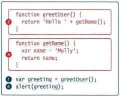
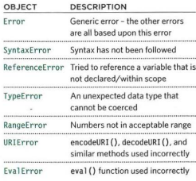
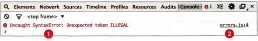
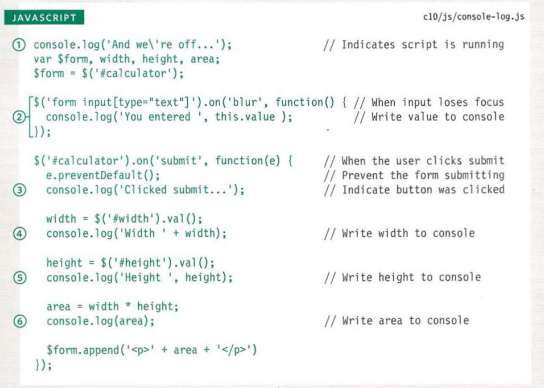
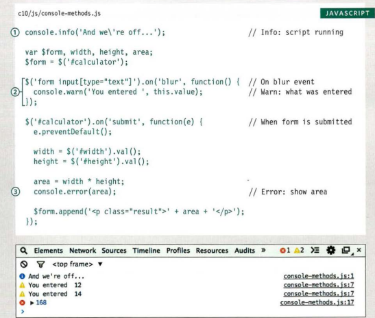

# Error Handling & Debugging
JavaScript can be hard to learn and everyone makes mistakes when writing it.

## ORDER OF EXECUTION 
To find the source of an error, it helps to know how scripts are processed.
The order in which statements are executed can be complex; some tasks
cannot complete until another statement or function has been run: 

This script above creates a greeting message, then
writes it to an alert box (see right-hand page). In order to create that greeting, two functions are used:
greetUser () and getName () . 

1 . The greeting variable gets its value from the
greetUser() function.

2 . greetUser() creates the message by combining
the string 'He 11 o ' with the result of getName ().

3 . getName () returns the name to greetUser().

2 . greetUser() now knows the name, and combines
it with the string. It then returns the message to the
statement that called it in step 1.

1 . The value of the greeting is stored in memory.

4 . This greeting variable is written to an alert box.

## EXECUTION CONTEXTS 
The JavaScript interpreter uses the concept of execution contexts.
There is one global execution context; plus, each function creates a new
new execution context. They correspond to variable scope. 

## EXECUTION CONTEXT & HOISTING 
Each time a script enters a new execution context, there are two phases
of activity:

1. PREPARE

* The new scope is created
* Variables, functions, and arguments are created
* The value of the this keyword is determined

2. EXECUTE 

* Now it can assign values to variables
* Reference functions and run their code
* Execute statements

## UNDERSTANDING SCOPE 
In the interpreter, each execution context has its own va ri ables object.
It holds the variables, functions, and parameters available within it.
Each execution context can also access its parent's variables object. 

## UNDERSTANDING ERRORS
If a JavaScript statement generates an error, then it throws an exception.
At that point, the interpreter stops and looks for exception-handl ing code.

## ERROR OBJECTS
Error objects can help you find where your mistakes are
and browsers have tools to help you read them.

1. In the red on the left, you can see this is a
SyntaxError. An unexpected character was found.
errors.js:4
2. On the right, you can see that the error happened
in a file called errors .js on line 4.

## ERROR OBJECTS CONTINUED

### SyntaxError 
SYNTAX IS NOT CORRECT

This is caused by incorrect use of the rules of the
language. It is often the result of a simple typo. 

### ReferenceError 
VARIABLE DOES NOT EXIST

This is caused by a variable that is not declared or is
out of scope.

### EvalError
INCORRECT USE OF eval() FUNCTION

The eval () function evaluates text through the
interpreter and runs it as code. It is rare that you would see this type
of error, as browsers often throw other errors when
they are supposed to throw an EvalError. 

### URI Error
INCORRECT USE OF URI FUNCTIONS 

If these characters are not escaped in URls, they will
cause an error: / ? & I : ; 

### Type Error 
VALUE IS UNEXPECTED DATA TYPE

This is often caused by trying to use an object or
method that does not exist. 

### RangeError
NUMBER OUTSIDE OF RANGE 

If you call a function using numbers outside of its
accepted range

### Error
GENERIC ERROR OBJECT 

The generic Error object is the template (or
prototype) from which all other error objects are created.

### NaN
NOT AN ERROR 

Note: If you perform a mathematical operation using
a value that is not a number, you end up with the
value of NaN, not a type error. 

## HOW TO DEAL WITH ERRORS
Now that you know what an error is and how the browser treats them,
there are two things you can do with the errors

1. DEBUG THE SCRIPT TO FIX ERRORS
2. HANDLE ERRORS GRACEFULLY

## BROWSER DEV TOOLS & JAVASCRIPT CONSOLE 
The JavaScript console will tell you when there is a problem with a script,
where to look for the problem, and what kind of issue it seems to be

The JavaScript console is just one of several developer tools that are
found in all modern browsers. 

## LOGGING DATA TO THE CONSOLE

1. The first line is used to indicate
the script is running
2. Next an event handler waits
for the user leaving a text input,
and logs the value that they
entered into that form field.
3. That the user clicked submit
4. The value in the width input
5. The value in the height input
6. The value of the area variable

## MORE CONSOLE METHODS 
1. con so 1 e. info() can be used
for general information
2. consol e.warn() can be used
for warnings
3. console .er ror() can be used
to hold errors

## BREAKPOINTS
You can pause the execution of a script on any
line using breakpoints. Then you can check the
values stored in variables at that point in time

## STEPPING THROUGH CODE
If you set multiple breakpoints, you can step
through them one-by-one to see where values
change and a problem might occur. 

## CONDITIONAL BREAKPOINTS
You can indicate that a breakpoint should be
triggered only if a condition that you specify is
met. The condition can use existing variables.

## HANDLING EXCEPTIONS 
If you know your code might fail, use try, catch, and finally.
Each one is given its own code block.

* TRY : First, you specify the code
that you think might throw an
exception within the try block. 
* CATCH : If the try code block throws an
exception, catch steps in with an
alternative set of code. 
* FINALLY : The contents of the finally
code block will run either
way - whether the try block
succeeded or failed.

