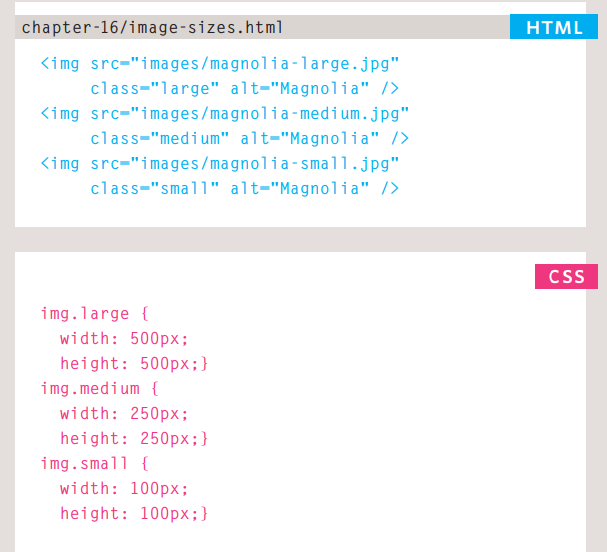
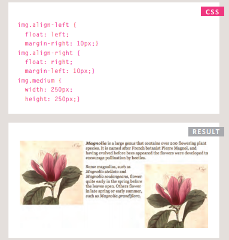
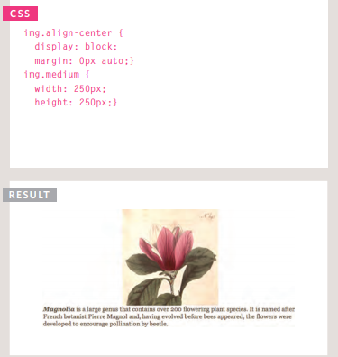
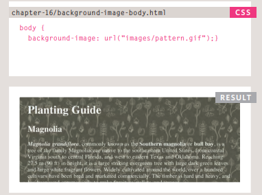
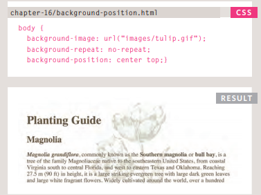
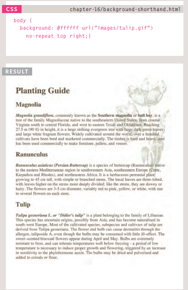
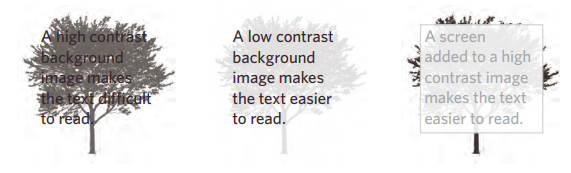
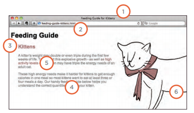
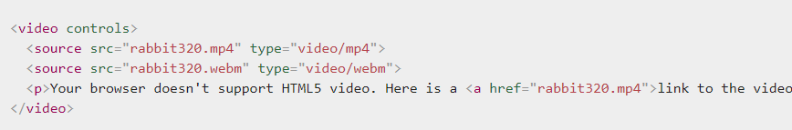

# Images
## Controlling sizes of images in Css
You can control the size of an
image using the width and
height properties in CSS, just
like you can for any other box.

Specifying image sizes helps
pages to load more smoothly
because the HTML and CSS
code will often load before the
images, and telling the browser
how much space to leave for an
image allows it to render the rest
of the page without waiting for
the image to download.

## AligNing images Using CSS
1. The float property is added
to the class that was created to
represent the size of the image 
2. New classes are created with
names such as align-left or
align-right to align the images
to the left or right of the page.
These class names are used in
addition to classes that indicate
the size of the image.

## Centering images Using Css

By default, images are inline
elements. This means that they
flow within the surrounding text.
In order to center an image, it
should be turned into a blocklevel element using the display
property with a value of block.

## Background Images

The background-image
property allows you to place
an image behind any HTML
element. This could be the entire
page or just part of the page. By
default, a background image will
repeat to fill the entire box.

## Background Position

When an image is not being
repeated, you can use the
background-position
property to specify where in the
browser window the background
image should be placed.
This property usually has a pair
of values. The first represents
the horizontal position and the
second represents the vertical.

## shorthand
The background property acts
like a shorthand for all of the
other background properties
you have just seen, and also the
background-color property.

The properties must be specified
in the following order, but you
can miss any value if you do not
want to specify it.

## Contrast of background images

If you want to overlay text on a background image, the image must be low
contrast in order for the text to be legible.

* High Contrast : 
The majority of photographs
have quite a high contrast, which
means that they are not ideal for
use as a background image.

* Low Contrast : Image editing applications such
as Photoshop and GIMP have
tools that allow you to manually
adjust your images to have lower
contrast.

* Screen : To overlay text on an image with
high contrast, you can place a
semi-transparent background
color (or "screen") behind the
text to improve legibility

# Practical Information
## Search Engine Optimization (SEO)

1. The Basics

Search engine optimization (or
SEO) is the practice of trying
to help your site appear nearer
the top of search engine results
when people look for the topics
that your website covers.

2. On-Page Techniques

On-page techniques are the
methods you can use on your
web pages to improve their
rating in search engines

3. Off-Page Techniques

Getting other sites to link to you
is just as important as on-page
techniques. Search engines help
determine how to rank your
site by looking at the number of
other sites that link to yours.

## On-Page S

In every page of your website there are seven key places where keywords
(the words people might search on to find your site) can appear in order
to improve its findability.

1. Page Title : The page title appears at the top
of the browser window or on the
tab of a browser. It is specified in
the < title > element which lives inside the < head > element
2. URL / Web Address : The name of the file is part of
the URL. Where possible, use
keywords in the file name
3. Headings : If the keywords are in a heading
< hn > element then a search
engine will know that this page is
all about that subject and give it
greater weight than other text
4. Text : Where possible, it helps to repeat the keywords in the main
body of the text at least 2-3
times. Do not, however, over-use
these terms, because the text
must be easy for a human to
read.
5. Link Text : Use keywords in the text that
create links between pages
(rather than using generic
expressions such as "click here")
6. Image Alt Text : Search engines rely on you
providing accurate descriptions
of images in the alt text. This
will also help your images show
up in the results of image-based
searches.
7. Page Descriptions : The description also lives inside
the < head> element and is
specified using a < meta> tag.
It should be a sentence that
describes the content of the
page

## How to Identify Keywords and Phrases
Determining which keywords to use on your site can be one of the
hardest tasks when you start to think about SEO. Here are six steps that
will help you identify the right keywords and phrases for your site.

1. Brainstorm : List down the words that
someone might type into
Google to find your site. Be sure
to include the various topics,
products or services your site is about.
2. Organize : Group the keywords into
separate lists for the different
sections or categories of your
website.
3. Research : There are several tools that let
you enter your keywords and
then they will suggest additional
keywords you might like to
consider.
4. Compare : It is very unlikely that your
site will appear at the top of
the search results for every
keyword. This is especially true
for topics where there is a lot
of competition. The more sites
out there that have already been
optimized for a given keyword,
the harder it will be for you to
rise up the search results when
people search on that term
5. Refine : Now you need to pick which
keywords you will focus on.
These should always be the ones
that are most relevant to each
section of your site.
6. Map : Now that you have a refined list
of keywords, you know which
have the most competition, and
which ones are most relevant,
it is time to start picking which
keywords you will use for each
page.

## What Are Your Visitors Looking At?
The content link on the left-hand side allows
you to learn more about what the visitors are
looking at when they come to your site.

1. Pages : This tells you which pages your
visitors are looking at the most
and also which pages they are
spending the most time on.
2. Landing Pages : These are the pages that people
arrive on when first visiting your
site. This can be particularly
helpful because you may find
people are not always coming
into your site via the homepage.
3. Top Exit Pages : This shows which pages people
most commonly leave from. If
a lot of people are leaving from
the same page then you might
consider changing that page or
improving it.
4. Bounce Rate : This shows the number of people
who left on the same page that
they arrived on. A high bounce
rate suggests that the content is
not what they were looking for or
that the page did not sufficiently
encourage them to look around
the rest of the site.

## FTP & Third Party Tools
To transfer your code and images from your
computer to your hosting company, you use
something known as File Transfer Protocol.

# Video and Audio APIs
HTML5 comes with elements for embedding rich media in documents — < video > and < audio > — which in turn come with their own APIs for controlling playback, seeking, etc. This article shows you how to do common tasks such as creating custom playback controls.

## HTML5 video and audio
The < video > and < audio > elements allow us to embed video and audio into web pages. As we showed in Video and audio content, a typical implementation looks like this:

## The HTMLMediaElement API
Part of the HTML5 spec, the HTMLMediaElement API provides features to allow you to control video and audio players programmatically — for example HTMLMediaElement.play(), HTMLMediaElement.pause(), etc. This interface is available to both < audio> and < video> elements, as the features you'll want to implement are nearly identical.

The time display currently breaks if the video is an hour long or more (well, it won't display hours; just minutes and seconds). 

Because < audio > elements have the same HTMLMediaElement functionality available to them, you could easily get this player to work for an < audio > element too.

an you work out a way to turn the timer inner < div > element into a true seek bar/scrabbler — i.e., when you click somewhere on the bar, it jumps to that relative position in the video playback? As a hint, you can find out the X and Y values of the element's left/right and top/bottom sides via the getBoundingClientRect() method, and you can find the coordinates of a mouse click via the event object of the click event, called on the Document object.
