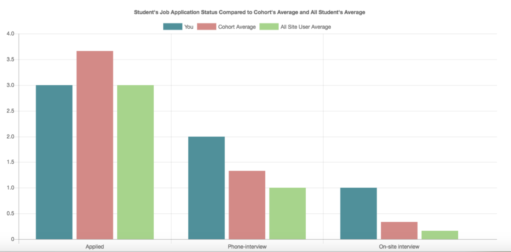
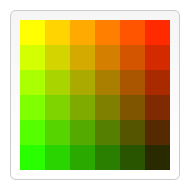

# Chart.js, Canvas

## EASILY CREATE STUNNING ANIMATED CHARTS WITH CHART.JS

***Charts*** are for **displaying data visually** tand an added benefit that no one is ever going to press-gang them into use as a layout tool. 

***Chart.js***, a JavaScript plugin that uses HTML5’s canvas element to draw the graph onto the page. It’s a well documented plugin that makes using all kinds of bar charts, line charts, pie charts and more easy.

**Sample code for setting up a chart:**

```
// pie chart options
 var pieOptions = {
   segmentShowStroke : false,
      animateScale : true
        }
 // get pie chart canvas
 var countries= document.getElementById("countries").getContext("2d");
 // draw pie chart
 new Chart(countries).Pie(pieData, pieOptions);
 // bar chart data
 var barData = {
 labels : ["January","February","March","April","May","June"],
       datasets : [
            {
              fillColor : "#48A497",
              strokeColor : "#48A4D1",
              data : [456,479,324,569,702,600]
  },
        {
            fillColor : "rgba(73,188,170,0.4)",
            strokeColor : "rgba(72,174,209,0.4)",
            data : [364,504,605,400,345,320]
                    }
                ]
            }
 // get bar chart canvas
  var income = document.getElementById("income").getContext("2d");
  // draw bar chart
  new Chart(income).Bar(barData);
 ```
 
 **Sample figure:**
 
 
 
 
 ## Basic usage of canvas
 
 ### The `<canvas>` element
 
 `
 <canvas id="tutorial" width="150" height="150"></canvas>
 `

 The `<canvas> `element differs from an `` tag in that, like for `<video>`, `<audio>`, or `<picture>` elements, it is easy to define some fallback content, to be displayed in older browsers not supporting it, like versions of Internet Explorer earlier than version 9 or textual browsers. You should always provide fallback content to be displayed by those browsers.
 Providing fallback content is very straightforward: just insert the alternate content inside the `<canvas>` element.
 
 ```
 <canvas id="stockGraph" width="150" height="150">
  current stock price: $3.15 + 0.15
</canvas>

<canvas id="clock" width="150" height="150">
  
</canvas>
 ```

 ## Drawing shapes with canvas
 
 
 ### Drawing rectangles
 
There are three functions that draw rectangles on the canvas:

`fillRect(x, y, width, height)`
Draws a filled rectangle.

`strokeRect(x, y, width, height)`
Draws a rectangular outline.

`clearRect(x, y, width, height)`
Clears the specified rectangular area, making it fully transparent


## Drawing paths

Here are the functions that draw paths on the canvas:

`beginPath()`
Creates a new path. Once created, future drawing commands are directed into the path and used to build the path up.

`Path methods`
Methods to set different paths for objects.

`closePath()`
Adds a straight line to the path, going to the start of the current sub-path.

`stroke()`
Draws the shape by stroking its outline.

`fill()`
Draws a solid shape by filling the path's content area.

## Drawing a triangle

For example, the code for drawing a triangle would look something like this:

```
function draw() {
  var canvas = document.getElementById('canvas');
  if (canvas.getContext) {
    var ctx = canvas.getContext('2d');

    ctx.beginPath();
    ctx.moveTo(75, 50);
    ctx.lineTo(100, 75);
    ctx.lineTo(100, 25);
    ctx.fill();
  }
}
```


## Applying styles and colors

### Color

there are two important properties we can use: `fillStyle` and `strokeStyle`.

`fillStyle = color`
Sets the style used when filling shapes.

`strokeStyle = color`
Sets the style for shapes' outlines.


**fillstyle**


**strokstyle**




### Transparency

`globalAlpha = transparencyValue`
Applies the specified transparency value to all future shapes drawn on the canvas. The value must be between 0.0 (fully transparent) to 1.0 (fully opaque). This value is 1.0 (fully opaque) by default.

 
## Drawing text
 
### Drawing text

The canvas rendering context provides two methods to render text:

`fillText(text, x, y [, maxWidth])`
Fills a given text at the given (x,y) position. Optionally with a maximum width to draw.

`strokeText(text, x, y [, maxWidth])`
Strokes a given text at the given (x,y) position. Optionally with a maximum width to draw. 
 

### Styling text

There are some more properties which let you adjust the way the text gets displayed on the canvas:

`font = value`
The current text style being used when drawing text. This string uses the same syntax as the CSS font property. The default font is 10px sans-serif.

`textAlign = value`
Text alignment setting. Possible values: start, end, left, right or center. The default value is start.

`textBaseline = value`
Baseline alignment setting. Possible values: top, hanging, middle, alphabetic, ideographic, bottom. The default value is alphabetic.

`direction = value`
Directionality. Possible values: ltr, rtl, inherit. The default value is inherit.


### Advanced text measurements
`measureText()`
Returns a TextMetrics object containing the width, in pixels, that the specified text will be when drawn in the current text style.